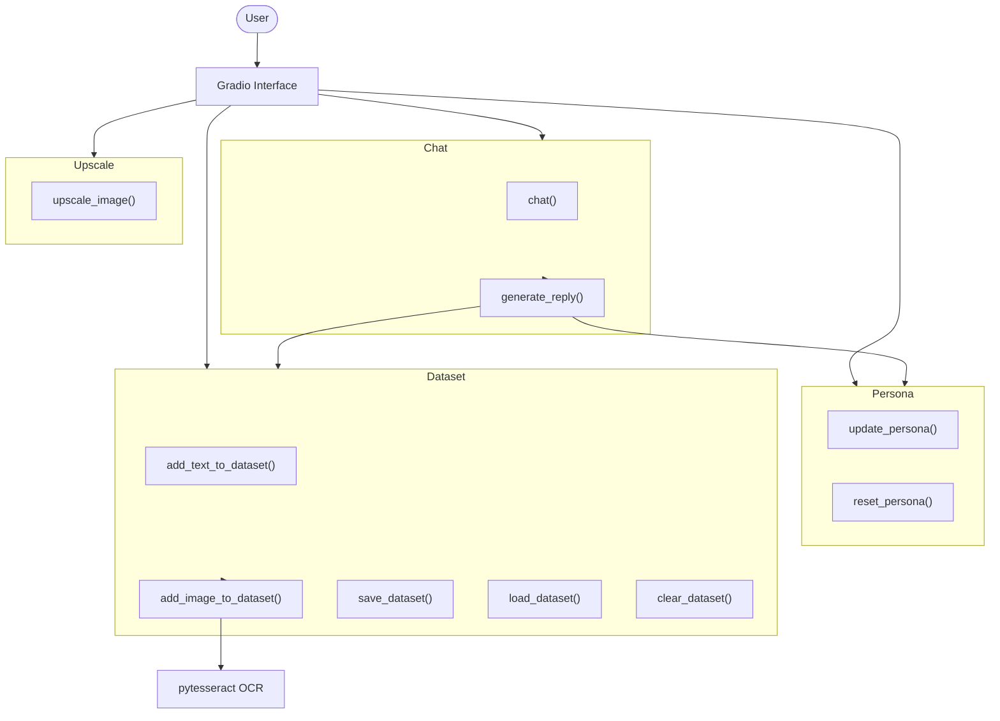

# WAIFU-WEBUI 🌸✨

A Gradio web UI for creating a simple waifu companion. 🖼️

The interface provides tools to build a custom persona from manga panels,
edit character attributes and chat with the generated companion. Manga
images can be uploaded for text extraction via OCR, which populates a dataset
used for simple dialogue generation.


## Installation 🔧

1. Clone this repository.
2. Install the dependencies with `pip install -r requirements.txt`.
3. Install Tesseract OCR so manga pages can be processed:

```bash
pip install pillow gradio pytesseract  # 🔧
```

## Usage 🚀

Run `python app.py` to launch the interface at `http://localhost:7860`.
The UI exposes several tabs:

- **Persona** – edit the waifu's attributes.
- **Chat** – talk with the persona. Replies come from the dataset or the catchphrase.
- **Dataset** – collect text from manga pages or manual input and save it.
- **Upscale** – simple image upscaling (placeholder functionality).
- **About** – details about this demo.

## Game Flow 🕹️

The diagram below summarizes how the main parts of the application
interact. Each object corresponds to a section of the code in
`app.py` that provides a specific function.



## Testing 🧪

Run the unit tests with [pytest](https://pytest.org/):

```bash
PYTHONPATH=. pytest -v
```


## License 📜

This project is released under the terms of the [Unlicense](LICENSE).
